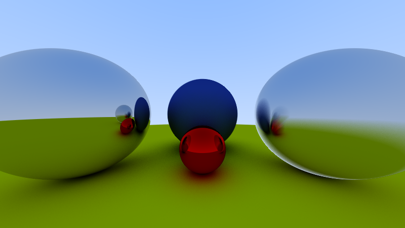

# Accelerated Ray Tracing

A high-performance path tracing implementation showcasing multi-platform rendering with CPU (sequential and OpenMP) and GPU (CUDA) support. This project demonstrates how to write flexible, portable code that compiles and runs efficiently on both CPU and GPU architectures without sacrificing performance.



## Overview

This project implements a **path tracing** algorithm, a Monte Carlo rendering technique that simulates physically-based light behavior to produce photorealistic images. Unlike traditional Whitted-style ray tracing, path tracing uses random sampling to solve the rendering equation, achieving natural global illumination effects like soft shadows, color bleeding, and realistic material interactions.

The implementation supports multiple materials (Lambertian diffuse and metal with configurable roughness) and renders scenes composed of spheres with realistic light transport.

### Module Architecture

**CORE Module**
Contains the fundamental ray tracing components designed for multi-platform compilation. Key features:
- CUDA-compatible code using `__host__`, `__device__`, and `__global__` decorators
- GLM math library with CUDA support
- Custom pseudo-random number generator (non-cryptographic hash-based)
- Avoids recursion, virtual functions, and STL containers for GPU compatibility

**CPU Module**
Builds two executables from the same source:
- `raytracer-seq`: Sequential single-threaded execution
- `raytracer-omp`: Parallel execution using OpenMP (conditional compilation)

**CUDA Module**
GPU-accelerated implementation that recompiles CORE sources with NVCC, leveraging CUDA kernels for parallel pixel rendering.

## Dependencies

### Required
- **CMake** ≥ 3.18
- **C++ Compiler** with C++17 support (GCC 11+ recommended)
- **GLM** (OpenGL Mathematics library)
  ```bash
  # Ubuntu/Debian
  sudo apt install libglm-dev

  # Arch Linux
  sudo pacman -S glm

  # macOS
  brew install glm
  ```

### Optional
- **OpenMP** (for parallel CPU execution)
  - Usually included with GCC/Clang

- **CUDA Toolkit** ≥ 11.5 (for GPU execution)
  - Download from [NVIDIA Developer Portal](https://developer.nvidia.com/cuda-downloads)
  - Requires NVIDIA GPU with compute capability 5.2+

## Building

### Basic Build
```bash
# Create build directory
mkdir -p build && cd build

# Configure project (auto-detects CUDA and OpenMP)
cmake ..

# Compile
make -j$(nproc)

# Executables will be in build/bin/
ls bin/
# Output: raytracer-seq  raytracer-omp*  raytracer-cuda*
# (*if dependencies are available)
```

### Build Configuration

**Force disable CUDA** (CPU-only build):
```bash
cmake -DCMAKE_CUDA_COMPILER=OFF ..
```

**Specify CUDA architectures** (optional optimization):
```cmake
# Edit src/cuda/CMakeLists.txt, uncomment and adjust:
set(CMAKE_CUDA_ARCHITECTURES 52 61 75 86)
```

**Debug build**:
```bash
cmake -DCMAKE_BUILD_TYPE=Debug ..
```

## Usage

### Basic Execution
```bash
./build/bin/raytracer-seq <width> <samples> <max_bounce>

# Example: 800px width, 100 rays/pixel, 16 max bounces
./build/bin/raytracer-seq 800 100 16
```

**Parameters:**
- `width`: Image width in pixels (height auto-calculated for 16:9 aspect ratio)
- `samples`: Rays per pixel (higher = less noise, slower rendering)
- `max_bounce`: Maximum ray bounces (higher = more accurate indirect lighting)

**Output**: PPM image file in the current directory

### Batch Rendering
Use the provided script to test multiple configurations:
```bash
./run.sh build/bin/raytracer-cuda
```

This runs predefined parameter combinations and saves results to `outputs/<executable-name>/`

### Performance Comparison
```bash
# Sequential CPU (baseline)
time ./build/bin/raytracer-seq 800 100 16

# Parallel CPU (OpenMP)
time ./build/bin/raytracer-omp 800 100 16

# GPU (CUDA)
time ./build/bin/raytracer-cuda 800 100 16
```

## Technical Highlights

1. **Cross-platform Core**: Single codebase compiles to both CPU and GPU targets using preprocessor macros and CUDA compatibility headers
2. **No Virtual Dispatch**: Uses C unions instead of polymorphism for GPU-friendly material system
3. **Custom RNG**: Hash-based PRNG seeded per-pixel for deterministic, parallel-safe random sampling
4. **GLM Integration**: Leverages GLM's CUDA support for vector/matrix operations

## Viewing Output

PPM images can be viewed with:
```bash
# ImageMagick
display output.ppm


# Convert to PNG
convert output.ppm output.png
```

## Further Reading

See [docs/report.pdf](docs/report.pdf) for detailed algorithm explanation, implementation notes, and academic analysis (in Serbian).